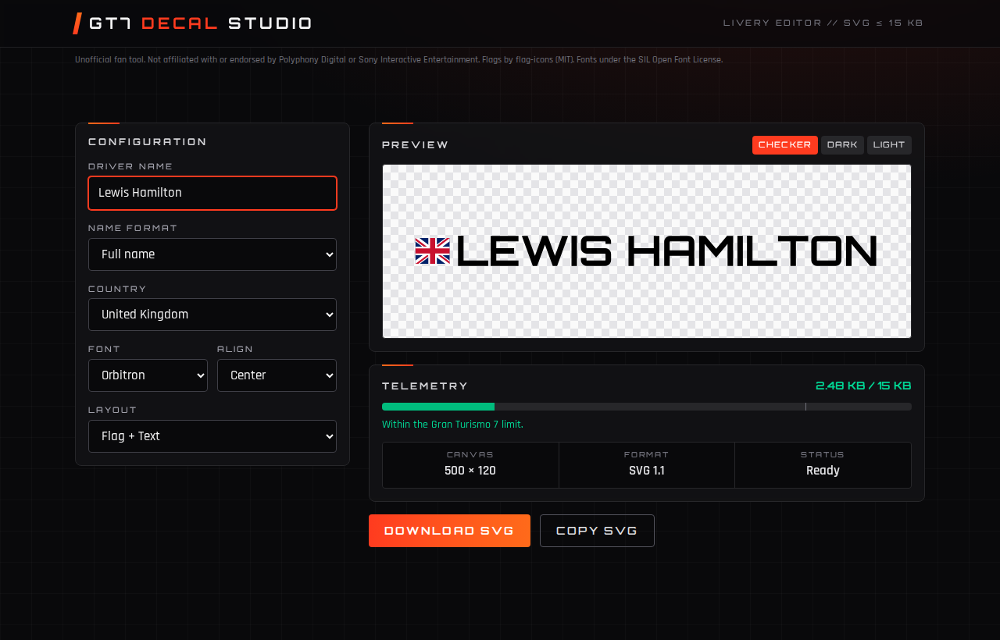
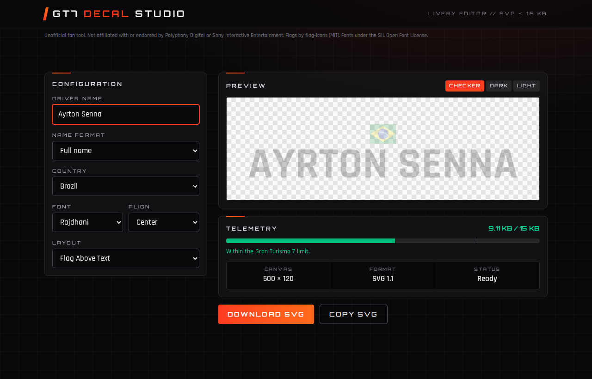
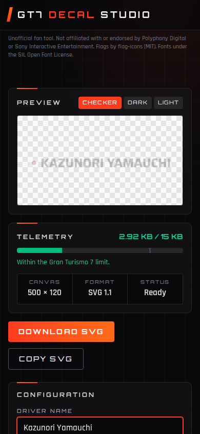

# GT7 Decal Studio: Gran Turismo 7 Driver Decal Generator

[](https://github.com/gmanucci/gt7-driver-decal/actions/workflows/ci.yml)
[](https://github.com/gmanucci/gt7-driver-decal/actions/workflows/deploy.yml)

**Make a custom Gran Turismo 7 (GT7) driver name decal with a country flag in a few seconds.** The decal is a clean SVG file under GT7's **15 KB** limit, so you can upload it to the GT7 Decal Editor and put it on your livery.

- 🏁 **Live app:** https://gmanucci.github.io/gt7-driver-decal/
- 📦 **Repository:** https://github.com/gmanucci/gt7-driver-decal



## Features

- **Driver name decals with country flags:** pick from **189 country flags** and type your name.
- **GT7-ready SVG output:** glyphs are converted to vector paths, so you don't need to install any fonts. The SVG is also optimized to stay as small as possible.
- **15 KB size meter:** the app shows the file's UTF-8 size as you edit and turns off the download button when the decal is over the GT7 upload limit.
- **Name formats:** full name, initial + last name, last name only, or initials.
- **Motorsport fonts:** Orbitron, Rajdhani and Saira, all under the SIL Open Font License.
- **Layouts:** Flag + Text, Text + Flag, Flag Above Text, Text Above Flag and Text Only, with left, center and right alignment.
- **Preview on any background:** switch between checkerboard, dark and light to see how the decal looks on your car.
- **Download or copy the SVG** with one click.
- **Missing-glyph warnings:** the app tells you when the selected font can't draw a character in your name.
- **Runs entirely in your browser:** no account and no uploads. It also works on phones.
- **Reusable core engine:** `@gt7/core` doesn't depend on any framework, so other front ends (React, Vue, PWA and others) can use it too.

## Screenshots

| Vertical layout | Mobile |
| --- | --- |
|  |  |

## How to use your decal in Gran Turismo 7

1. Open **[GT7 Decal Studio](https://gmanucci.github.io/gt7-driver-decal/)**, type your driver name and pick your country.
2. Choose a name format, font and layout, then click **Download SVG**.
3. Sign in to the [Gran Turismo website](https://www.gran-turismo.com/) and upload the SVG with the GT7 decal uploader.
4. In the game, open the Livery Editor, find the decal in your uploaded decals and put it on your car.

## Getting started (development)

The project needs Node.js 24 and npm workspaces.

```bash
git clone https://github.com/gmanucci/gt7-driver-decal.git
cd gt7-driver-decal
npm ci
npm run build:core   # build the framework-agnostic decal engine
npm start            # start the Angular dev server at http://localhost:4200
```

| Command | Description |
| --- | --- |
| `npm run test:core` | Run the core engine tests |
| `npm run test:web` | Run the web app tests |
| `npm run build:web` | Build the production web app |

## Project structure

```
apps/web         Angular + Tailwind CSS web app (GT7 Decal Studio)
packages/core    Framework-agnostic decal engine (layout, SVG rendering, optimization, size validation)
packages/assets  Pre-built flag and font glyph data
tools            Scripts that build and validate the flag and font assets
```

For the full design, see [implementation.md](implementation.md).

## Disclaimer

This is an unofficial fan tool. It isn't affiliated with or endorsed by Polyphony Digital or Sony Interactive Entertainment. "Gran Turismo" is a trademark of Sony Interactive Entertainment Inc. Flags come from [flag-icons](https://github.com/lipis/flag-icons) (MIT). Fonts are licensed under the SIL Open Font License.

---

**Keywords:** Gran Turismo 7 decal, GT7 driver name decal, GT7 livery name, GT7 flag decal, GT7 SVG decal generator, Gran Turismo livery editor, racing name sticker, sim racing decal.
